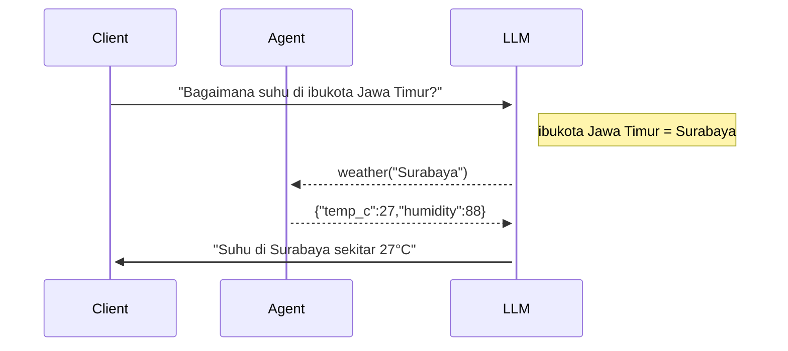

# Ngoprek LLM (Large Language Model)

Yang diperlukan: [kunci API (_API key_) dari OpenAI](https://platform.openai.com/account/api-keys) yang disimpan di variabel lingkungan bernama `OPENAI_API_KEY`.

**Perhatikan**: pemakaian API dari OpenAI akan membutuhkan biaya, karena tidak gratis, sehingga Anda bisa mendapatkan _API key_ setelah memasukkan metoda pembayaran terlebih dahulu.

Kebutuhan lain: [Node.js 18](https://nodejs.org/) atau yang lebih baru.

Contoh menjalankan demo untuk melengkapi kalimat (_completion_):

```
$ node complete.js "Sukarno dan Hatta pada tahun 1945"
```

Contoh menjalankan demo untuk bertanya:

```
$ node ask.js "Berapa jumlah penduduk Bandung?"
```

Contoh menjalankan demo untuk mencari info detil:

```
$ node query.js "Bagaimana suhu di ibukota Jawa Timur?"
```


