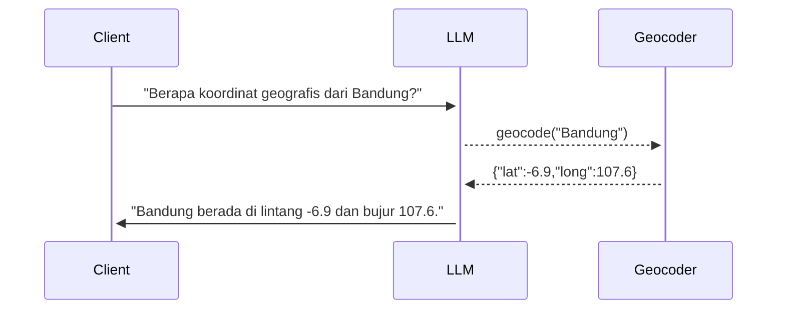
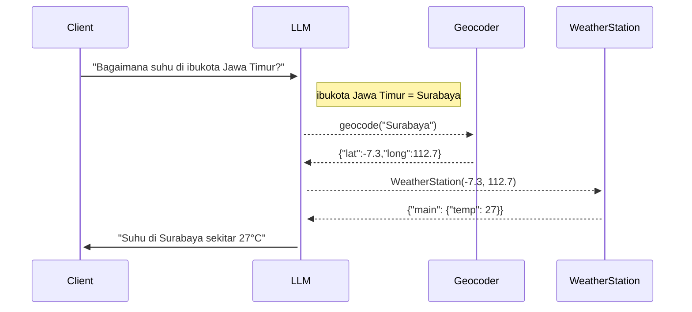

# Ngoprek LLM (Large Language Model)

Yang diperlukan: [kunci API (_API key_) dari OpenAI](https://platform.openai.com/account/api-keys) yang disimpan di variabel lingkungan bernama `OPENAI_API_KEY`.

**Perhatikan**: pemakaian API dari OpenAI akan membutuhkan biaya, karena tidak gratis, sehingga Anda bisa mendapatkan _API key_ setelah memasukkan metoda pembayaran terlebih dahulu.

Kebutuhan lain: [Node.js 18](https://nodejs.org/) atau yang lebih baru.

### Versi JavaScript

Contoh menjalankan demo untuk melengkapi kalimat (_completion_):

```
$ node complete.js "Sukarno dan Hatta pada tahun 1945"
```

Contoh menjalankan demo untuk bertanya:

```
$ node ask.js "Berapa jumlah penduduk Bandung?"
```

Contoh menjalankan demo untuk mencari info detil:

```
$ node query.js "Berapa koordinat geografis dari Bandung?"
```



```
$ node query.js "Bagaimana suhu di ibukota Jawa Timur?"
```



### Versi Clojure

Demo versi Clojure bisa dijalankan langsung lewat terminal sebagaimana dicontohkan di bawah ini, akan tetapi lebih baik dipahami dan dicoba dengan menggunakan REPL (misalnya dengan [Visual Studio Code](https://code.visualstudio.com/) + [Calva](https://marketplace.visualstudio.com/items?itemName=betterthantomorrow.calva) atau [Vim](https://www.vim.org/)/[NeoVim](https://neovim.io/) + [vim-iced plugin](https://github.com/liquidz/vim-iced)).

Pertama, pastikan modul yang dibutuhkan sudah terpasang:

```
$ npm install
```

Contoh menjalankan demo untuk melengkapi kalimat (_completion_):

```
$ npm run nbb complete.cljs "Ibukota Indonesia adalah"
```

Contoh menjalankan demo untuk bertanya:

```
$ npm run nbb ask.cljs "Apa ibukota Jawa Timur?"
```

Contoh menjalankan demo untuk mencari info detil:

```
$ npm run nbb probe.cljs "Kapan saya terakhir ke Bandung?"
```
